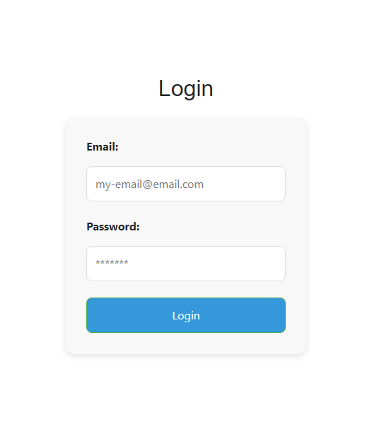
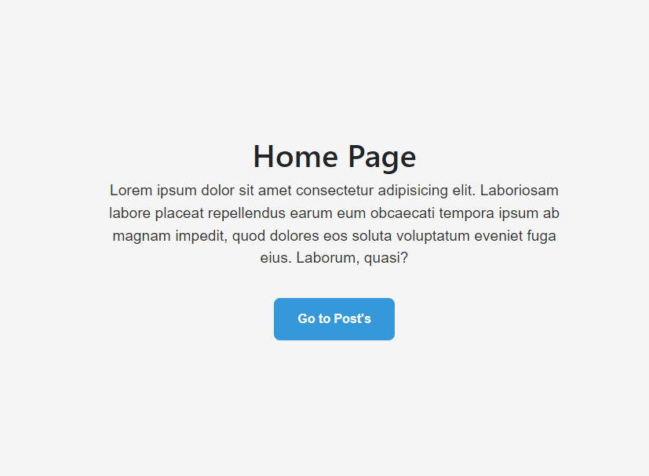

# Proyecto-Argentina programa tramo III

El mismo consiste en la creación de una Plataforma Interactiva de Posts con Registro y Login

## Ejecucion back

Cambiar el nombre del archivo .env.example a .env
Definir puerto en el archivo .env
Para ejecutarlo "npm run dev" 

## Ejecucion front

Cambiar el nombre del archivo .env.example a .env
Definir puerto en el archivo .env
Para ejecutarlo "npm run dev" 
luego en el navegador desde [Servidor local](http://localhost:4000)

## Web

## Registro

## Login

## Home
