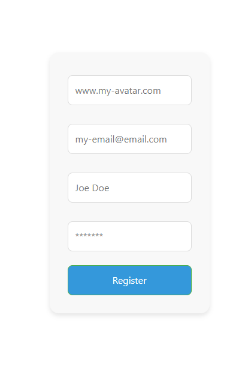

# Proyecto-Argentina programa

El mismo consiste en un Foro Personalizado en entorno individual y aislado, para crear y compartir publicaciones de temas variados en una página web personal.

## Ejecucion back

Cambiar el nombre del archivo .env.example a .env
Definir puerto en el archivo .env
Para ejecutarlo "npm run dev" 

## Ejecucion front

Cambiar el nombre del archivo .env.example a .env
Definir puerto en el archivo .env
Para ejecutarlo "npm run dev" 
luego en el navegador desde [Servidor local](http://localhost:4000)

## Web

## Registro
